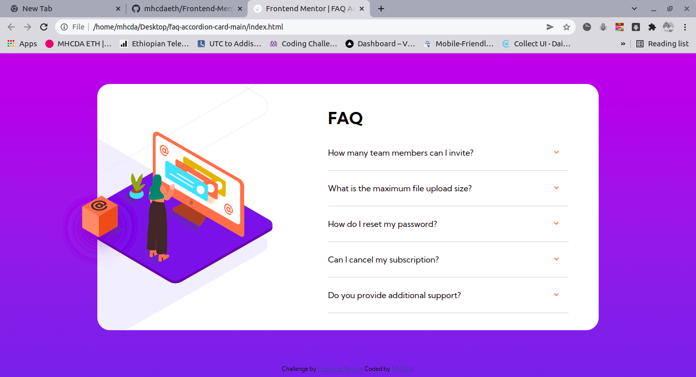
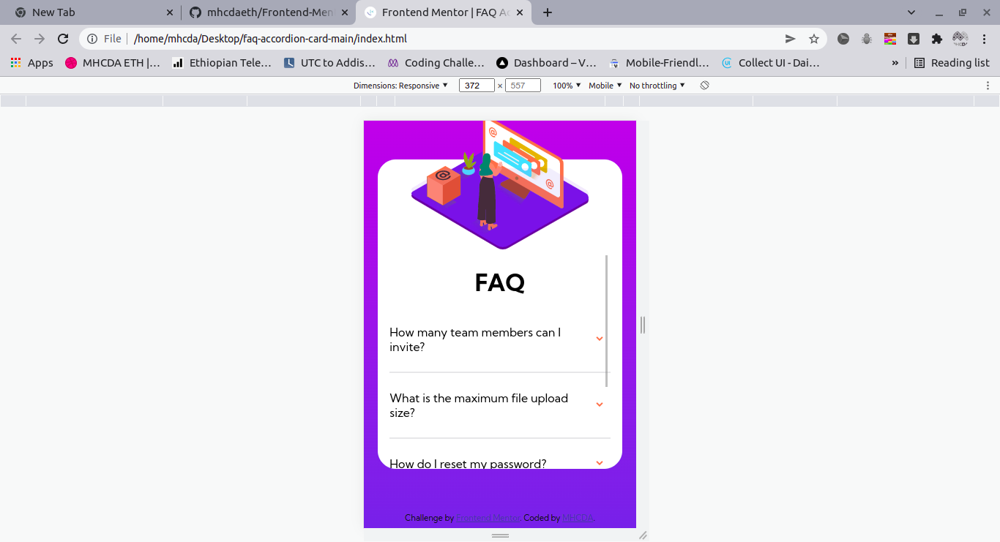

# Frontend Mentor - FAQ accordion card solution

This is a solution to the [FAQ accordion card challenge on Frontend Mentor](https://www.frontendmentor.io/challenges/faq-accordion-card-XlyjD0Oam). Frontend Mentor challenges help you improve your coding skills by building realistic projects. 

## Table of contents

- [Overview](#overview)
  - [The challenge](#the-challenge)
  - [Screenshot](#screenshot)
- [My process](#my-process)
  - [Built with](#built-with)
  - [What I learned](#what-i-learned)
  - [Useful resources](#useful-resources)
- [Author](#author)


## Overview

### The challenge

Users should be able to:

- View the optimal layout for the component depending on their device's screen size
- See hover states for all interactive elements on the page
- Hide/Show the answer to a question when the question is clicked

### Screenshot




## My process

- first i bulit it with mobile first and then desktop after all of that the js functionality

### Built with

- Semantic HTML5 markup
- CSS custom properties
- Flexbox
- CSS Grid
- Mobile-first workflow
- Js
### What I learned

Use this section to recap over some of your major learnings while working through this project. Writing these out and providing code samples of areas you want to highlight is a great way to reinforce your own knowledge.

To see how you can add code snippets, see below:

```html
<div class="faq">

      <div class="lists">
        <h1>FAQ</h1>

        <div class="qAnda">
  
          <div class="q">
           <p> How many team members can I invite? </p>
           <div class="img">
             
           </div>
          </div>
            <div class="a">
             <p> You can invite up to 2 additional users on the Free plan. There is no limit on 
              team members for the Premium plan. </p>
            </div>    
            
            <hr>
  
            <div class="q">
              <p> What is the maximum file upload size? </p>
              <div class="img">
                
              </div>
            </div>
            <div class="a">
              <p>No more than 2GB. All files in your account must fit your allotted storage space.</p>
            </div>
            
            <hr>
```


```js loops and gives all the html elements a event listener with out typing event listener for all the question elelemts

var answer = document.querySelectorAll(".a")
var question = document.querySelectorAll(".q")
var arrow = document.querySelectorAll(".q .img")
var qLength = document.querySelectorAll(".q").length

for(var i = 0; i < qLength; i++){
    
    get(i)

}

function get(number){

    console.log(question[number].addEventListener("click", function(){
        this.classList.toggle("bold")
        arrow[number].classList.toggle("rotate")
        console.log(answer[number].classList.toggle("view"))

    }))

}
```

### Useful resources

- [Example resource 1](https://www.w3schools.com) - Best referance for every html css and js codes
- [Example resource 2](https://www.mdn.com) - Best for more detial explaination on every css js html properties or more in my openion

## Author

- MHCDA WEB - [Personal Website](https://l.instagram.com/?u=https%3A%2F%2Fmhcdaeth.github.io%2Fmhcda-eth-web-v2.0%2F&e=ATPAww3rFG5eut5TBkT5JUcz9pju1Or8E1VaQyVT1fWS6D3_cLLe5tsUEGmN_pBT1FEnFj8wRmuSvyAWc19S7hA&s=1)
- Frontend Mentor - [@mhcdaeth](https://www.frontendmentor.io/profile/mhcdaeth)
- Twitter - [@MhcdaE](https://twitter.com/MhcdaE/)
